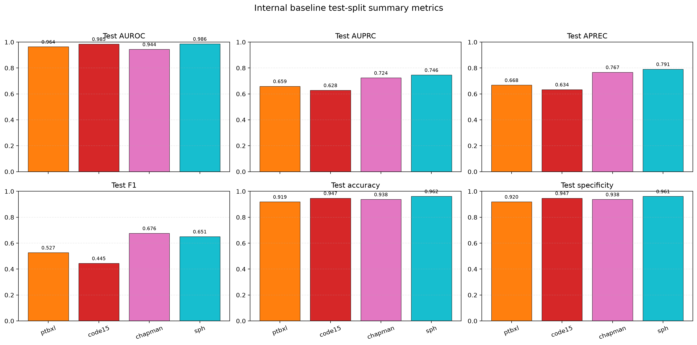
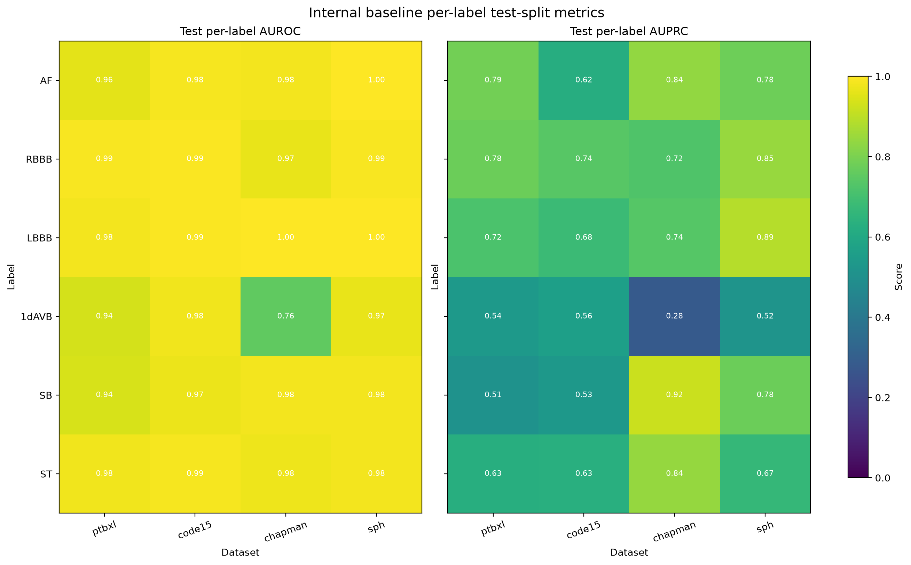

# ResNet1D Internal Dataset Baseline Results

This folder contains the saved evaluation tables and figures for the internal supervised baseline.
Metrics follow `jeremykid/Statistical_tool/genearte_reports/generate_report.py`: thresholds are selected on the training split with ROC / Youden's J, predictions use strict `pred_proba > threshold`, and the per-label report keeps both `auprc` and `aprec` as separate fields.
Per-label undefined values remain `n/a` in the rendered table and `NaN` in the CSV outputs.

## Overall summary

| dataset | dataset_name | output_dir | train_records | validation_records | test_records | best_epoch | best_validation_macro_auprc | validation_accuracy | validation_auroc | validation_auprc | validation_f1_score | validation_prec | validation_rec | validation_sensitivity | validation_spec | validation_aprec | validation_br_score | test_accuracy | test_auroc | test_auprc | test_f1_score | test_prec | test_rec | test_sensitivity | test_spec | test_aprec | test_br_score |
| --- | --- | --- | --- | --- | --- | --- | --- | --- | --- | --- | --- | --- | --- | --- | --- | --- | --- | --- | --- | --- | --- | --- | --- | --- | --- | --- | --- |
| ptbxl | ptbxl | ptbxl | 17418 | 2183 | 2198 | 5 | 0.680 | 0.921 | 0.965 | 0.650 | 0.523 | 0.392 | 0.905 | 0.905 | 0.922 | 0.680 | 0.022 | 0.919 | 0.964 | 0.659 | 0.527 | 0.399 | 0.916 | 0.916 | 0.920 | 0.668 | 0.022 |
| code15 | code15 | code15 | 241957 | 34562 | 69260 | 5 | 0.645 | 0.947 | 0.984 | 0.627 | 0.448 | 0.305 | 0.948 | 0.948 | 0.947 | 0.645 | 0.010 | 0.947 | 0.985 | 0.628 | 0.445 | 0.302 | 0.954 | 0.954 | 0.947 | 0.634 | 0.010 |
| chapman | chapman | chapman | 7452 | 1065 | 2129 | 4 | 0.751 | 0.933 | 0.935 | 0.742 | 0.700 | 0.609 | 0.865 | 0.865 | 0.934 | 0.751 | 0.033 | 0.938 | 0.944 | 0.724 | 0.676 | 0.586 | 0.852 | 0.852 | 0.938 | 0.767 | 0.029 |
| sph | sph | sph | 18049 | 2575 | 5146 | 5 | 0.813 | 0.960 | 0.991 | 0.736 | 0.620 | 0.503 | 0.969 | 0.969 | 0.959 | 0.812 | 0.012 | 0.962 | 0.986 | 0.746 | 0.651 | 0.540 | 0.951 | 0.951 | 0.961 | 0.791 | 0.014 |

## Per-label metrics

| dataset | split | label | threshold | accuracy | auroc | auprc | f1_score | prec | rec | sensitivity | spec | aprec | br_score | tn | fp | fn | tp | support |
| --- | --- | --- | --- | --- | --- | --- | --- | --- | --- | --- | --- | --- | --- | --- | --- | --- | --- | --- |
| ptbxl | validation | AF | 0.235 | 0.963 | 0.974 | 0.797 | 0.775 | 0.673 | 0.914 | 0.914 | 0.967 | 0.848 | 0.021 | 1965 | 67 | 13 | 138 | 151 |
| ptbxl | validation | RBBB | 0.159 | 0.940 | 0.983 | 0.760 | 0.709 | 0.564 | 0.952 | 0.952 | 0.940 | 0.872 | 0.023 | 1895 | 122 | 8 | 158 | 166 |
| ptbxl | validation | LBBB | 0.024 | 0.967 | 0.981 | 0.678 | 0.601 | 0.451 | 0.902 | 0.902 | 0.968 | 0.807 | 0.011 | 2055 | 67 | 6 | 55 | 61 |
| ptbxl | validation | 1dAVB | 0.111 | 0.877 | 0.939 | 0.533 | 0.337 | 0.210 | 0.850 | 0.850 | 0.878 | 0.499 | 0.027 | 1847 | 256 | 12 | 68 | 80 |
| ptbxl | validation | SB | 0.131 | 0.867 | 0.947 | 0.539 | 0.286 | 0.170 | 0.906 | 0.906 | 0.866 | 0.484 | 0.026 | 1835 | 284 | 6 | 58 | 64 |
| ptbxl | validation | ST | 0.029 | 0.910 | 0.967 | 0.596 | 0.432 | 0.284 | 0.904 | 0.904 | 0.910 | 0.567 | 0.026 | 1911 | 189 | 8 | 75 | 83 |
| ptbxl | test | AF | 0.235 | 0.964 | 0.961 | 0.788 | 0.772 | 0.687 | 0.882 | 0.882 | 0.970 | 0.818 | 0.023 | 1985 | 61 | 18 | 134 | 152 |
| ptbxl | test | RBBB | 0.159 | 0.948 | 0.988 | 0.777 | 0.735 | 0.598 | 0.952 | 0.952 | 0.948 | 0.879 | 0.021 | 1926 | 106 | 8 | 158 | 166 |
| ptbxl | test | LBBB | 0.024 | 0.968 | 0.982 | 0.719 | 0.632 | 0.469 | 0.968 | 0.968 | 0.968 | 0.881 | 0.009 | 2068 | 68 | 2 | 60 | 62 |
| ptbxl | test | 1dAVB | 0.111 | 0.867 | 0.937 | 0.537 | 0.321 | 0.197 | 0.873 | 0.873 | 0.867 | 0.437 | 0.027 | 1837 | 282 | 10 | 69 | 79 |
| ptbxl | test | SB | 0.131 | 0.857 | 0.938 | 0.508 | 0.259 | 0.153 | 0.859 | 0.859 | 0.857 | 0.356 | 0.028 | 1829 | 305 | 9 | 55 | 64 |
| ptbxl | test | ST | 0.029 | 0.910 | 0.978 | 0.627 | 0.445 | 0.289 | 0.963 | 0.963 | 0.908 | 0.637 | 0.022 | 1922 | 194 | 3 | 79 | 82 |
| code15 | validation | AF | 0.072 | 0.957 | 0.985 | 0.631 | 0.476 | 0.318 | 0.942 | 0.942 | 0.958 | 0.676 | 0.010 | 32423 | 1430 | 41 | 668 | 709 |
| code15 | validation | RBBB | 0.015 | 0.974 | 0.992 | 0.736 | 0.668 | 0.513 | 0.957 | 0.957 | 0.974 | 0.788 | 0.009 | 32726 | 874 | 41 | 921 | 962 |
| code15 | validation | LBBB | 0.025 | 0.973 | 0.995 | 0.680 | 0.555 | 0.389 | 0.972 | 0.972 | 0.973 | 0.774 | 0.006 | 33029 | 927 | 17 | 589 | 606 |
| code15 | validation | 1dAVB | 0.018 | 0.922 | 0.978 | 0.561 | 0.287 | 0.169 | 0.953 | 0.953 | 0.921 | 0.531 | 0.011 | 31321 | 2670 | 27 | 544 | 571 |
| code15 | validation | SB | 0.018 | 0.908 | 0.966 | 0.521 | 0.241 | 0.139 | 0.901 | 0.901 | 0.909 | 0.405 | 0.012 | 30895 | 3109 | 55 | 503 | 558 |
| code15 | validation | ST | 0.035 | 0.950 | 0.989 | 0.633 | 0.460 | 0.302 | 0.962 | 0.962 | 0.949 | 0.695 | 0.010 | 32082 | 1711 | 29 | 740 | 769 |
| code15 | test | AF | 0.072 | 0.957 | 0.985 | 0.621 | 0.461 | 0.306 | 0.936 | 0.936 | 0.958 | 0.668 | 0.010 | 65034 | 2874 | 87 | 1265 | 1352 |
| code15 | test | RBBB | 0.015 | 0.972 | 0.993 | 0.739 | 0.665 | 0.505 | 0.972 | 0.972 | 0.972 | 0.792 | 0.009 | 65415 | 1875 | 55 | 1915 | 1970 |
| code15 | test | LBBB | 0.025 | 0.974 | 0.995 | 0.682 | 0.559 | 0.392 | 0.971 | 0.971 | 0.974 | 0.807 | 0.006 | 66316 | 1768 | 34 | 1142 | 1176 |
| code15 | test | 1dAVB | 0.018 | 0.919 | 0.980 | 0.565 | 0.278 | 0.162 | 0.967 | 0.967 | 0.919 | 0.473 | 0.011 | 62594 | 5554 | 37 | 1075 | 1112 |
| code15 | test | SB | 0.018 | 0.911 | 0.971 | 0.534 | 0.248 | 0.143 | 0.923 | 0.923 | 0.911 | 0.412 | 0.012 | 62088 | 6072 | 85 | 1015 | 1100 |
| code15 | test | ST | 0.035 | 0.951 | 0.987 | 0.629 | 0.458 | 0.301 | 0.957 | 0.957 | 0.951 | 0.652 | 0.011 | 64424 | 3336 | 65 | 1435 | 1500 |
| chapman | validation | AF | 0.115 | 0.934 | 0.980 | 0.849 | 0.835 | 0.763 | 0.922 | 0.922 | 0.937 | 0.926 | 0.051 | 818 | 55 | 15 | 177 | 192 |
| chapman | validation | RBBB | 0.128 | 0.975 | 0.992 | 0.810 | 0.780 | 0.658 | 0.960 | 0.960 | 0.975 | 0.899 | 0.010 | 990 | 25 | 2 | 48 | 50 |
| chapman | validation | LBBB | 0.041 | 0.991 | 0.997 | 0.773 | 0.706 | 0.545 | 1.000 | 1.000 | 0.991 | 0.719 | 0.007 | 1043 | 10 | 0 | 12 | 12 |
| chapman | validation | 1dAVB | 0.031 | 0.841 | 0.689 | 0.290 | 0.176 | 0.109 | 0.450 | 0.450 | 0.857 | 0.090 | 0.036 | 878 | 147 | 22 | 18 | 40 |
| chapman | validation | SB | 0.174 | 0.931 | 0.981 | 0.919 | 0.910 | 0.858 | 0.969 | 0.969 | 0.911 | 0.957 | 0.057 | 623 | 61 | 12 | 369 | 381 |
| chapman | validation | ST | 0.284 | 0.927 | 0.970 | 0.813 | 0.795 | 0.719 | 0.888 | 0.888 | 0.934 | 0.913 | 0.040 | 836 | 59 | 19 | 151 | 170 |
| chapman | test | AF | 0.115 | 0.934 | 0.982 | 0.839 | 0.820 | 0.727 | 0.941 | 0.941 | 0.933 | 0.908 | 0.044 | 1670 | 120 | 20 | 319 | 339 |
| chapman | test | RBBB | 0.128 | 0.966 | 0.966 | 0.724 | 0.676 | 0.539 | 0.905 | 0.905 | 0.968 | 0.830 | 0.013 | 1980 | 65 | 8 | 76 | 84 |
| chapman | test | LBBB | 0.041 | 0.994 | 0.999 | 0.735 | 0.684 | 0.542 | 0.929 | 0.929 | 0.995 | 0.884 | 0.002 | 2104 | 11 | 1 | 13 | 14 |
| chapman | test | 1dAVB | 0.031 | 0.861 | 0.757 | 0.283 | 0.140 | 0.082 | 0.471 | 0.471 | 0.871 | 0.114 | 0.023 | 1809 | 269 | 27 | 24 | 51 |
| chapman | test | SB | 0.174 | 0.932 | 0.984 | 0.921 | 0.912 | 0.865 | 0.965 | 0.965 | 0.913 | 0.967 | 0.056 | 1235 | 117 | 27 | 750 | 777 |
| chapman | test | ST | 0.284 | 0.940 | 0.976 | 0.841 | 0.827 | 0.762 | 0.905 | 0.905 | 0.947 | 0.903 | 0.038 | 1698 | 95 | 32 | 304 | 336 |
| sph | validation | AF | 0.046 | 0.973 | 0.983 | 0.748 | 0.679 | 0.521 | 0.974 | 0.974 | 0.973 | 0.880 | 0.007 | 2431 | 68 | 2 | 74 | 76 |
| sph | validation | RBBB | 0.015 | 0.995 | 1.000 | 0.922 | 0.915 | 0.843 | 1.000 | 1.000 | 0.995 | 0.981 | 0.002 | 2492 | 13 | 0 | 70 | 70 |
| sph | validation | LBBB | 0.061 | 0.998 | 1.000 | 0.796 | 0.783 | 0.692 | 0.900 | 0.900 | 0.998 | 0.967 | 0.001 | 2561 | 4 | 1 | 9 | 10 |
| sph | validation | 1dAVB | 0.051 | 0.930 | 0.991 | 0.550 | 0.182 | 0.100 | 1.000 | 1.000 | 0.930 | 0.426 | 0.006 | 2375 | 180 | 0 | 20 | 20 |
| sph | validation | SB | 0.457 | 0.929 | 0.984 | 0.783 | 0.737 | 0.594 | 0.970 | 0.970 | 0.924 | 0.872 | 0.048 | 2136 | 175 | 8 | 256 | 264 |
| sph | validation | ST | 0.013 | 0.935 | 0.987 | 0.619 | 0.422 | 0.270 | 0.968 | 0.968 | 0.934 | 0.750 | 0.011 | 2347 | 165 | 2 | 61 | 63 |
| sph | test | AF | 0.046 | 0.980 | 0.997 | 0.780 | 0.726 | 0.574 | 0.985 | 0.985 | 0.980 | 0.835 | 0.008 | 4909 | 100 | 2 | 135 | 137 |
| sph | test | RBBB | 0.015 | 0.990 | 0.991 | 0.847 | 0.829 | 0.724 | 0.970 | 0.970 | 0.990 | 0.966 | 0.003 | 4961 | 50 | 4 | 131 | 135 |
| sph | test | LBBB | 0.061 | 0.999 | 0.999 | 0.890 | 0.889 | 0.870 | 0.909 | 0.909 | 0.999 | 0.945 | 0.001 | 5121 | 3 | 2 | 20 | 22 |
| sph | test | 1dAVB | 0.051 | 0.929 | 0.967 | 0.517 | 0.200 | 0.112 | 0.920 | 0.920 | 0.929 | 0.296 | 0.008 | 4733 | 363 | 4 | 46 | 50 |
| sph | test | SB | 0.457 | 0.925 | 0.983 | 0.776 | 0.730 | 0.590 | 0.958 | 0.958 | 0.921 | 0.867 | 0.050 | 4240 | 362 | 23 | 521 | 544 |
| sph | test | ST | 0.013 | 0.949 | 0.982 | 0.665 | 0.532 | 0.368 | 0.962 | 0.962 | 0.948 | 0.838 | 0.013 | 4732 | 258 | 6 | 150 | 156 |

## Figures

## Files

- `results_summary.csv`
- `per_class_summary.csv`
- `resnet1d_internal_dataset_baseline_overall_metrics.png`
- `resnet1d_internal_dataset_baseline_overall_metrics.svg`
- `resnet1d_internal_dataset_baseline_per_label_metrics.png`
- `resnet1d_internal_dataset_baseline_per_label_metrics.svg`

## Source-script parity reports

Detailed report artifacts are written alongside each dataset output directory and are generated from the saved train/validation/test predictions.

### ptbxl
- `validation`
  - `ptbxl/generate_report/ptbxl_validation_report.json`
  - `ptbxl/generate_report/ptbxl_validation_report_curves.png`
  - `ptbxl/generate_report/ptbxl_validation_report_curves.svg`
  - `ptbxl/generate_report/ptbxl_validation_report_aux.png`
  - `ptbxl/generate_report/ptbxl_validation_report_aux.svg`
- `test`
  - `ptbxl/generate_report/ptbxl_test_report.json`
  - `ptbxl/generate_report/ptbxl_test_report_curves.png`
  - `ptbxl/generate_report/ptbxl_test_report_curves.svg`
  - `ptbxl/generate_report/ptbxl_test_report_aux.png`
  - `ptbxl/generate_report/ptbxl_test_report_aux.svg`

### code15
- `validation`
  - `code15/generate_report/code15_validation_report.json`
  - `code15/generate_report/code15_validation_report_curves.png`
  - `code15/generate_report/code15_validation_report_curves.svg`
  - `code15/generate_report/code15_validation_report_aux.png`
  - `code15/generate_report/code15_validation_report_aux.svg`
- `test`
  - `code15/generate_report/code15_test_report.json`
  - `code15/generate_report/code15_test_report_curves.png`
  - `code15/generate_report/code15_test_report_curves.svg`
  - `code15/generate_report/code15_test_report_aux.png`
  - `code15/generate_report/code15_test_report_aux.svg`

### chapman
- `validation`
  - `chapman/generate_report/chapman_validation_report.json`
  - `chapman/generate_report/chapman_validation_report_curves.png`
  - `chapman/generate_report/chapman_validation_report_curves.svg`
  - `chapman/generate_report/chapman_validation_report_aux.png`
  - `chapman/generate_report/chapman_validation_report_aux.svg`
- `test`
  - `chapman/generate_report/chapman_test_report.json`
  - `chapman/generate_report/chapman_test_report_curves.png`
  - `chapman/generate_report/chapman_test_report_curves.svg`
  - `chapman/generate_report/chapman_test_report_aux.png`
  - `chapman/generate_report/chapman_test_report_aux.svg`

### sph
- `validation`
  - `sph/generate_report/sph_validation_report.json`
  - `sph/generate_report/sph_validation_report_curves.png`
  - `sph/generate_report/sph_validation_report_curves.svg`
  - `sph/generate_report/sph_validation_report_aux.png`
  - `sph/generate_report/sph_validation_report_aux.svg`
- `test`
  - `sph/generate_report/sph_test_report.json`
  - `sph/generate_report/sph_test_report_curves.png`
  - `sph/generate_report/sph_test_report_curves.svg`
  - `sph/generate_report/sph_test_report_aux.png`
  - `sph/generate_report/sph_test_report_aux.svg`
